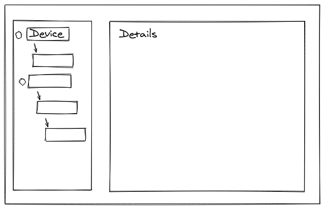

# :pencil:  Vue task
The idea of this test is to give you the chance to show off your design skills and to make a beautiful interface.  Please add icons, colors scheme, pay attention to margins etc etc..
You have to create SPA application in Vue using:
- [Vuetify](https://vuetifyjs.com/en/)
-  [Mock Service Worker](https://mswjs.io/)
-  Vuex

## :exclamation: Requirements
1. There should be one only one page.
2. Page should contain list of devices in the tree view (hierarchy parent - children).
3. Devices in tree view should contain device name, information about its status (offline/online), device type.
4. Details should contain informations about the device.
5. You should use Mock Service Worker library to mock api response based on data in `response.json`
6. You should use components from Vuetify and style it.
7. You should spend ~4 hours.

## :framed_picture: Sketch
 

## :fist: Good luck !!! 
